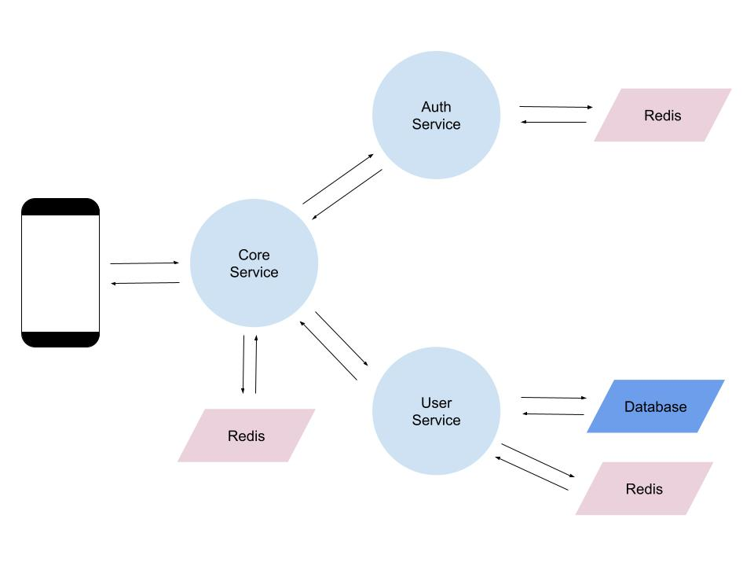
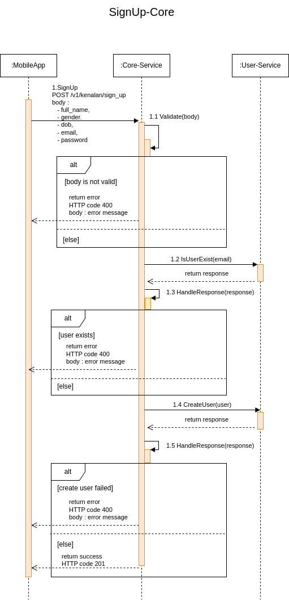
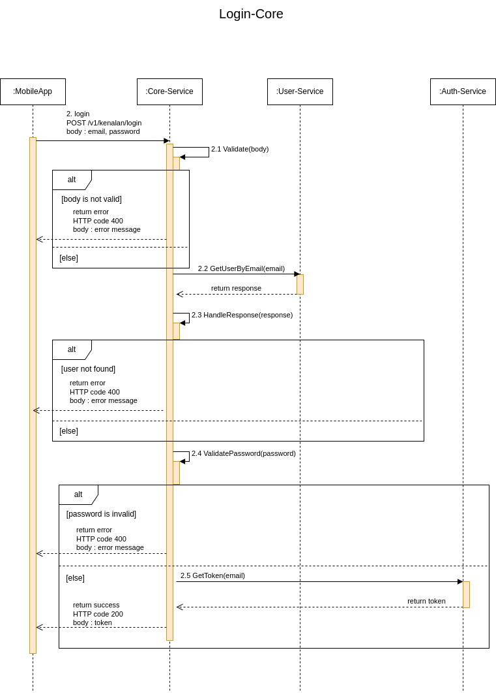
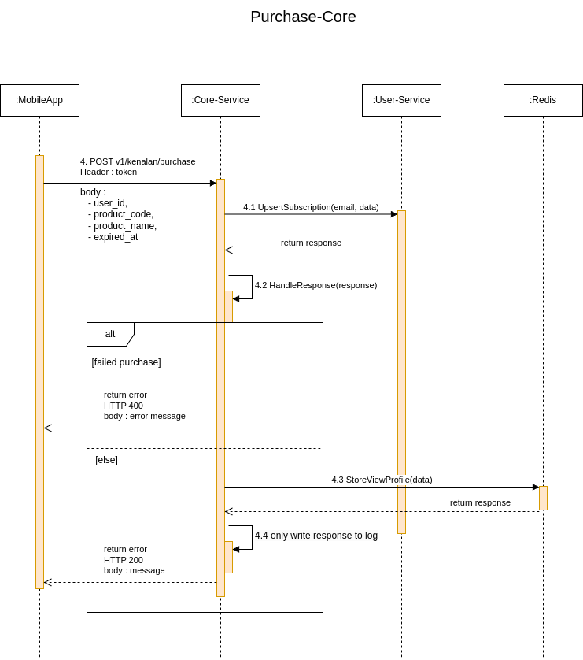
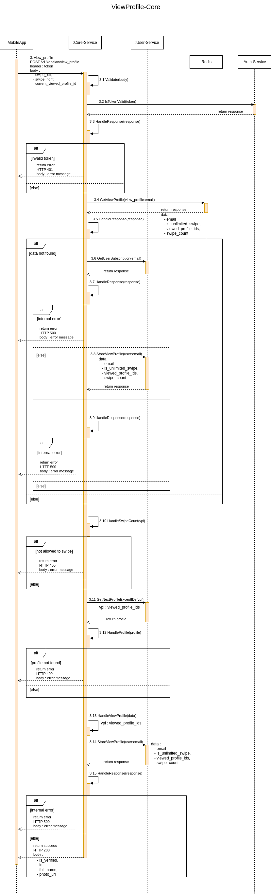

# Kenalan-Core
Core of System Kenalan

# Design and Architecture
- 
- 
- 
- 
- 

# Related Services
- https://github.com/atrariksa/kenalan-user
- https://github.com/atrariksa/kenalan-auth

# How to run
- check out repo
- docker compose up for running db and redis (optional), you can use your existing db and redis but adjust the creds accordingly
- create database with name kenalan (DDL can be checked at github repo kenalan-user)
- run kenalan-user & kenalan-auth service
- go run main.go

# Other
- Registered ProductCodes : 
  - "SKU001" for Unlimited Swipe
  - "SKU002" for Account Verified